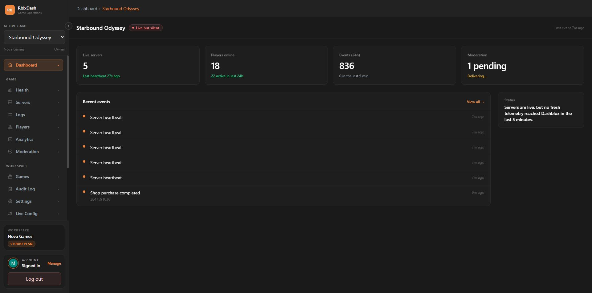
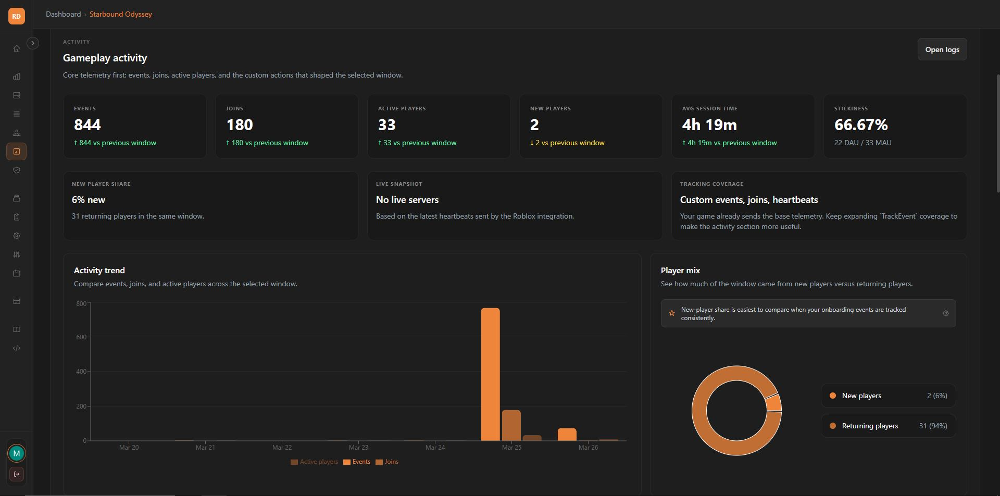
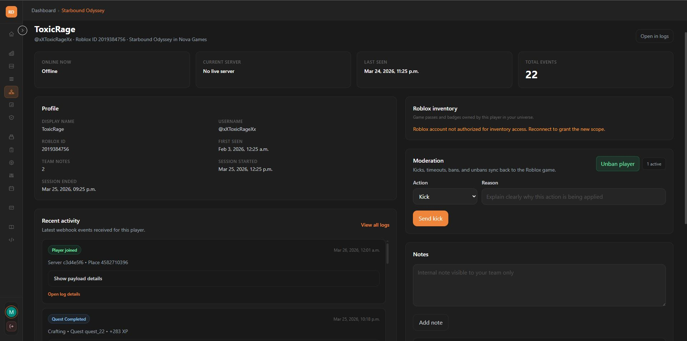
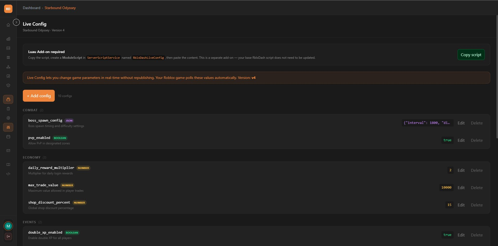
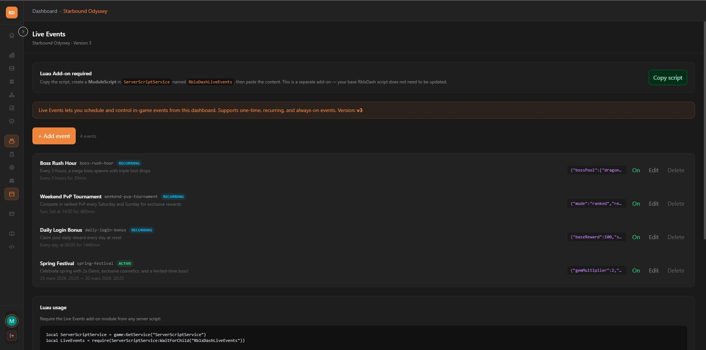

# DevForum Post

## Recommended Title

[Open Source] RblxDash - a community-friendly ops dashboard for Roblox games

## Post Body

Hi everyone,

I wanted to share **RblxDash**, an open-source dashboard I have been building for Roblox games.

The goal is simple: **help Roblox developers manage their game in one place, simply and quickly**.

Instead of bouncing between the Roblox dashboard, Studio, Discord bots, spreadsheets, and internal tools, RblxDash brings a lot of the day-to-day game operations workflow together in one place:

- live game health
- live analytics
- player profiles
- moderation
- logs
- live config
- live events
- team workspaces
- REST API

I am posting it here mainly as an **open-source resource for the community**, especially for developers who want something they can inspect, self-host, and help improve over time.

One of the biggest reasons I built it is that a lot of Roblox workflows still feel fragmented, and a lot of analytics feel too delayed when you need answers right now.

With RblxDash, the idea is to give developers **live visibility** into what is happening in their game now, not just later:

- live servers and players
- live event flow
- live analytics for activity, monetization, economy, and progression
- player investigation and moderation from the same place
- runtime tools like Live Config and Live Events without republishing every small change

Another big part of the project is that it is **open source**.

If you paste code into your game, you should be able to read it.
If you trust a tool with moderation and player data, you should be able to audit it.
If you want to self-host or extend it, you should be able to do that too.

And the long-term goal is not just to ship it and leave it there. The goal is to **keep improving RblxDash with the community** through feedback, feature requests, bug reports, and contributions.

If people find it useful, I want to keep pushing it forward as a real community-driven Roblox tool.

## Get Started

### Self-Hosted (Free & Open Source)

You can self-host RblxDash completely for free using the GitHub repo. The source code, quick start, self-hosting guide, and API docs are all there, so if you are comfortable deploying a standard Next.js + Postgres app, it should feel straightforward.

**https://github.com/misericorde0712/RblxDash**

### Hosted Option

If you do not want to host it yourself, there is also a hosted version you can use to try it quickly, including a free tier for getting started with a single game.

**https://rblxdash.com**

https://youtu.be/pzXGY5ueADQ

If you want one place to run your Roblox game with live visibility instead of piecing tools together, I would love your feedback.

Questions, criticism, feature requests, and contributions are welcome.

Not affiliated with Roblox Corporation.
